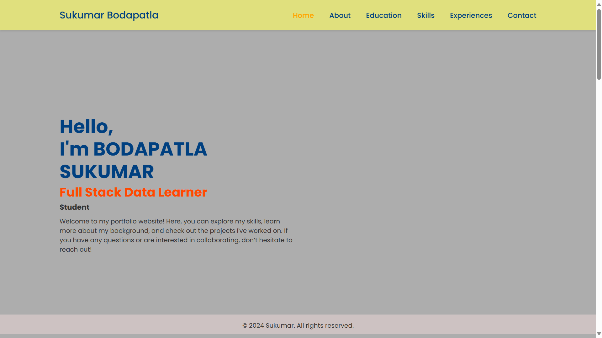

CODTECH-FULLSTACK-Task2
Project Overview:

Project Name: Portfolio with Backend
Developer Name: Bodapatla Sukumar
Company: Codtech IT Solutions
ID: CT08DS7726
Domain: Full-Stack Development
Duration: August 30, 2024 - September 30, 2024
Objective:
To create a personal portfolio website featuring a backend built with Flask. This project aims to showcase web development skills, enhance frontend design capabilities, and provide experience in backend development with Flask.

Key Activities:

Responsive Frontend Design:

Develop a visually appealing and responsive layout using HTML5 and CSS3.
Utilize JavaScript for interactive elements to improve user experience.
Ensure compatibility across various devices (desktop, mobile, tablet) for a seamless browsing experience.
Flask Backend Implementation:

Set up Flask to manage server-side operations and routing.
Create endpoints to handle content management, including projects and blog posts.
Implement CRUD (Create, Read, Update, Delete) operations for managing projects and content.
Integration:

Connect Flask with the frontend to display dynamic content.
Use Flask's templating system to render HTML pages with data from the backend.
Dynamically manage and display project details on the frontend.
Technologies Used:

Frontend: HTML5, CSS3 (using Flexbox/Grid for layout), JavaScript (ES6+)
Backend: Flask (Python)
Development Tools: Visual Studio Code

